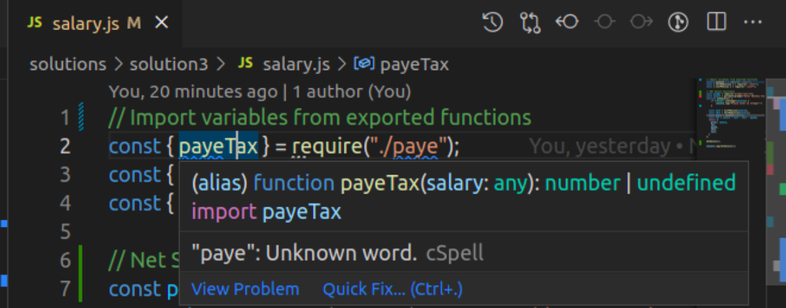

# Toy Problems
We are going to write code solutions for  three JavaScript programs. 
- Student Grade Generator
- Speed Detector
- Net Salary Calculator

### Getting Started 

**Challenge 1: Student Grade Generator**

Write a function that prompts the user to input student marks. The input should be between 0 and 100. The output should correspond the correct grade, as shown below: 

        A > 79, B - 60 to 79, C -  59 to 49, D - 40 to 49, E - less 40.

At the home directory, we will have a directory named `toyProblems` to host our three projects. Therefore, run `cd` at the CLI to move to the home directory then  run the command `mkdir toyProblems`to create a directory named `toyProblems`.

At the CLI still, run `cd toyProblems` to move into our working directory. Inside the directory, run `mkdir solutions` to create a directory to host our three solutions. Run `cd solutions` to move into the `solutions` directory and create a  file named `sol1.js`.

To create the file, run `touch sol1.js `. Let's make use of our tools now! To start-up our project inside the VS Code, run `code .` . For our program to prompt the user to input the student score, we'll need to install the `prompt-sync` node module.

Therefore, run `npm install prompt-sync` in the vs code terminal. Before you proceed, make sure you have `node` and  `NVM` installed. 
     
            npm install prompt-sync

The `prompt-sync` module creates prompting functions that will prompt the user for input once called.

Once you’ve loaded the prompt-sync module and called it, use it to retrieve user input. Inside `sol1.js` have your first line of code as `const prompt = require('prompt-sync')();`

Declare a function that prompts the user to parse in an integer with a value between 0 and 100.
- `const score = parseInt(prompt("Enter a value between 0 and 100:"));`

Declare another function that takes in the student `score` as its parameter `function studentScore(score) {}`.

To prevent the user from entering a string or a value that is not an integer, use the `if` conditional statement to run 

                `if ( !Number.isInteger(score)) {
                console.log("Please enter an Integer!");
                }` 

                 and 

                `if (score > 100) {
                console.log("Please enter  a value less than or equal to 100!");
                }`
                
                to restrict a value that is greater than 100.

Then continue applying the if, else condition statement and at the end of the block of code, call the initial function that takes student score as its parameter.  To execute this, run 
`studentScore(score);`

The condition statements should be nested inside the `function studentScore(score){}`function.

**Challenge 2: Speed Detector**

Write a program that takes the speed of a car as input e.g 80. If the speed is less than 70, it should print “Ok”.  Otherwise, for every 5 km/s above the speed limit (70), it should give the driver one demerit point and print the total number of demerit points.

   > For example, if the speed is 80, it should print: “Points: 2”. If the driver gets more than 12 points, the function should print: “License suspended”.

Our attempt here is to develop a solution to a program that is going to help monitor the speed of automobiles beyond the required driving limit `70km/hr` upto to some point where the driver's license is revoked.

Create a file named `sol2.js` in the same directory where we created our first `sol1.js`. To do this,  run the command `touch sol2.js`.

Just like in our first problem that required user prompt, we're equally going to write `const prompt = require('prompt-sync')();` as our fist line of code then declare a function that prompts, `Recorded speed` using the `const` keyword.
      
     ` const speed  = parseInt(prompt('Enter recorded speed:'));`

After that, declared a function `function carSpeed(speed) {}`that takes speed as its parameter and nest the if, else condition statements inside it.

On the second statement, for the generator to print a value of one or above demerit point(s) for every 5 km above 70km limit, we subtract our speed  limit from the total speed recorded and divide the result by five to get either one or 12 points or even way far above 12 that withdraws the driver license.

At the end of the block of code call the function, `carSpeed(speed);`

You're good to go!

**Challenge 3: Net Salary Calculator**

Write a program whose major task is to calculate an individual’s Net Salary by getting the inputs of basic salary and benefits. Calculate the payee (i.e. Tax), NHIF Deductions, NSSF Deductions, gross salary, and net salary. 

NB: Use KRA, NHIF, and NSSF values provided in the link below.

 - https://www.aren.co.ke/payroll/taxrates.htm

- https://www.aren.co.ke/payroll/taxrates.htm

- https://www.kra.go.ke/en/individual/calculate-tax/calculating-tax/paye

In this last question I am making an attempt to develop a function that would calculate the net salary of a given employee. However, my attempt may not answer the finer details of a sophisticated tax system but it would be  a basic or newbie approach that tries to replicate how ideally Kenyans pay tax. That's to say, the final value obtained may not tally with what's on paper.

On the same note, the arrangement of this project in terms of the required directory or file structure may not be the same as dictated by requirement 2 on having all solutions or a solution written in one file inside one directory. 

My approach seeks to tap more on how to export and import multiple JavaScript files. It's the quest for knowledge and to better understand how JavaScript works!

The final outcome of my attempt is a function that calculates what a typical Kenyan would take home as payday for the month.

The net salary in this case would be a subtraction of total deductions from the gross `salary`. These deductions are `payee`,`nhif` and `nssf`.

So the net salary would be, `net` = `salary` - `payee` - `nhif` -`nssf`.

My solution has four different files, one for gross `salary` and the remaining for each of the deductions, namely, `payee` , `nhif` , and `nssf`. Now, each of these files is hosted inside the sub-directory named, `solution3`. Its parent directory is `solutions`. 

The directory, `solution3` has four files namely, `paye.js`, `nhif.js` , `nssf.js` and `salary.js`.

Let's start of with the `payee`. At the end of each code block we're going to export our functions for the first three solutions as we'll later import them to calculate the `net` salary.

Declare a function that takes the parameter `salary` with a function name `payeTax()` and  inside the curly braces, declare `tax` as our block-scoped local variable, then employ the use of `if,else` condition statements that return `tax` at the end of each statement.  Execute the condition statements for the three salary values that had been provided in the links. Then at the end of the block of code, outside, export the function.

                // Export variables and functions
                `module.exports = {
                payeTax, 
                };`

Let's move to the next file on `nhif`. Here, we are going to declare a function that takes the parameter `salary`. Our function name is `nhifDeduction()`. 

Our block of code takes the `if,else` condition statements that have the `salary` parameter and `nhifMonthly` as variable to hold some certain value. For each salary earned by the employee(s) you are supposed to print out the `nhifMonthly` deduction and return it. This is how our code block should look like,

             if (salary > 100000) {
         const nhifMonthly = 1700;
         console.log(`Your NHIF Deduction is: ${nhifMonthly}`);
          return nhifMonthly;
         } 

Perform a repeated execution of the condition `else if ` statement for the remaining `salary` values provided then at the end of the execution, export the function as,

            // Export variables and `functions
         module.exports = {
         nhifDeduction,
         };`

In our third file, `nssf.js` we have a function with a function name `nssfPension()` that takes `salary` as its parameter. Inside the block we have a variable `nssfMonthly` that holds a flat-value of `200`.  There is not much to be performed except to return the `nssfMonthly` value. Thereafter, export the function.

      // Export variables and functions
      `module.exports =  {
       nssfPension,
       };`

On to our last file that is the solution to our problem. Here we are going to develop a solution that will help us calculate the `net` salary that we are bound to take home after the deductions have been made.

We will import the functions that we had exported at the end  of each code block in the three files, `paye.js`, `nhif.js` and `nssf.js`.   To import them we should have the following lines of code,

                // Import variables from exported functions
                const { payeTax } = require("./paye");
                const { nhifDeduction } = require("./nhif");
                const { nssfPension } = require("./nssf");

Let's  we have prompt *enabled*  so that we can convenient prompt the employee to enter a certain value of their salary and a function to prompt the user to enter their salary.  Therefore, our  line of code should look like this,

                //Net Salary Calculator
                const prompt = require("prompt-sync")();
                const salary = parseInt(prompt("Enter Monthly Gross Salary:"));

To restrict the employee from entering a value that could either be a string or anything else that is not `salary`,  we should declare a function whose code block  employs the `if` statement with a condition that must be met -- to enter a `salary` input that is an integer. The function name in my case is`netSalary()`

                function netSalary() {
                if (!Number.isInteger(salary)) {
                        console.log("Please enter an Integer!")
                };

Our code should look like this,
                // Net Salary Calculator
                const salary = parseInt(prompt("Enter Monthly Gross Salary:"));
                function netSalary() {
                if (!Number.isInteger(salary)) {
                        console.log("Please enter an Integer!")
                };

In the code block , next in line after the condition statement, we have four variables `nssf`, `nhif`, `payee` and `net` that should be returned as an object once the function `netSalary()` is printed out by use of the `console.log()` method.

Our code for this final  solution for the net salary calculator in this final file should look like this,

                
               // Import variables from exported functions
                const { payeTax } = require("./paye");
                const { nhifDeduction } = require("./nhif");
                const { nssfPension } = require("./nssf");
               
                // Net Salary Calculator
                const prompt = require("prompt-sync")();
                const salary = parseInt(prompt("Enter Monthly Gross Salary:"));
                function netSalary() {
                if (!Number.isInteger(salary)) {
                        console.log("Please enter an Integer!")
                }
                
                const nssf = nssfPension(salary);
                const nhif = nhifDeduction(salary);
                const payee = payeTax(salary);
                const net = salary - nssf - nhif - payee;
                return {
                gross: salary,
                net,
                payee,
                nhif,
                nssf,
                }
                };

                netSalary();

                console.log(netSalary());

We  have made an attempt to develop a program that calculates the  employee's net salary . However, when I hover over the `payeTax()` and `nhifDeduction()` functions I find them to be undefined and for reasons which I cannot tell. All the four functions work out so well except that there's an undefined once I hover the two functions. 

I am looking forward to an enlightenment here.

**undefined payeTax();**

 

**undefined nhifDeduction();**

Even so, thanks for reading through!